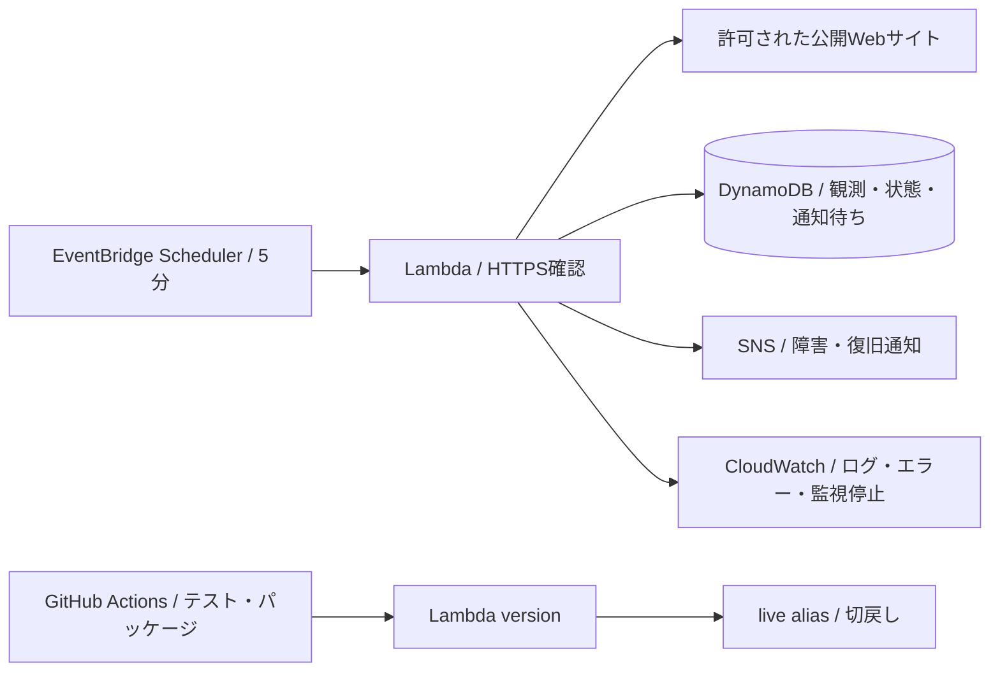

# Mimamori Ops / みまもり運用

日本の小規模企業・Web制作会社向けに、Webサイトの監視結果と障害の引継ぎ情報を日本語でまとめる個人学習プロジェクトです。

**状態:** ローカル実装・検証段階。AWSへのデプロイ、GitHub Actionsの実行、顧客利用、売上、実務経験の実績はありません。コード・文書の作成にAIを利用しています。

## 目的

- HTTPSの応答・TLS証明書の検証、連続失敗による障害判定、復旧通知。
- 監視履歴を基にした日本語の運用レポート。未観測の時間を稼働時間として扱わない。
- Terraform、GitHub Actions、IAM、CloudWatchを通じたAWS SAA学習。
- 調査 → 設計 → 変更管理 → テスト → 障害訓練 → 振り返りの証跡を残す。

## ローカルで実行

Python 3.13。デモ・単体テストは標準ライブラリのみで動作します。

```powershell
python -m unittest discover -s tests -v
python -m mimamori demo --output artifacts/local/demo.md
python -m mimamori estimate --targets 5 --interval 5
```

デモは固定時刻・架空の監視結果による障害訓練です。ネットワーク通信やメール送信は行いません。

2026-09-10のローカル検証: Pythonテスト30件、Terraformモックテスト3件、Lint、Terraform validate、Lambdaパッケージ生成が成功。AWSモック・リリースの全テストには `requirements-dev.txt` が必要です。標準ライブラリだけの実行では該当テストがskipされます。

実サイトの確認は自分が所有するか監視許可を得たHTTPS URLだけを設定してください。

```powershell
python -m mimamori check --id owned-site --url https://YOUR-OWNED-DOMAIN/ --db data/local.db
python -m mimamori report --id owned-site --db data/local.db --start 2026-09-01T00:00:00Z --end 2026-10-01T00:00:00Z --output artifacts/local/report.md
```

## 構成



公開API・ログイン・課金画面はありません。制作会社の担当者がCLIで設定とレポート出力を行う、運用支援MVPです。

## 資料

- [한국어 기획·시장 근거](docs/01-product-plan.ko.md)
- [설계·비용·제약](docs/02-architecture.ko.md)
- [운영·배포·롤백 절차](docs/03-runbook.ko.md)
- [SAA 학습·일본어 면접 연습](docs/04-learning-interview.ko.md)
- [협업 방식·백로그](docs/05-collaboration.ko.md)
- [검증 결과와 미확인 사항](docs/06-evidence.ko.md)

AWS 무료 사용 가능 여부는 계정 생성 시점, 플랜, 계정 전체 사용량, 리전에 따라 달라집니다. 무료 운용을 보장하지 않습니다. AWS 생성·변경과 외부 공개는 대상과 비용을 확인한 뒤 별도 진행합니다.
