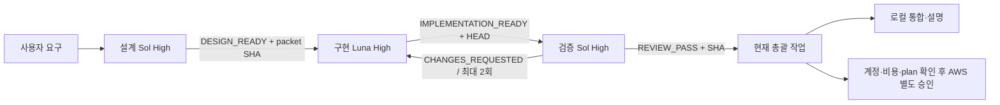

# 모델별 개발 파이프라인

설정일: 2026-09-10. 대상: Mimamori Ops. 사용자 요청에 따라 설계·구현·독립 검증을 각각 별도 Codex 작업으로 분리한다.

## 역할과 모델

| 단계 | 기본 모델·추론 | 작업 범위 | 다음 단계에 전달할 것 |
|---|---|---|---|
| 요구사항·설계·작업 분해 | GPT-5.6 Sol / High | 기존 코드 확인, 고객 문제, 인수 조건, IAM·비용·실패 동작 설계 | DESIGN_READY + 작업 패킷 커밋 |
| 구현·단위 테스트·문서 동기화 | GPT-5.6 Luna / High | 승인된 패킷 1개 구현, 관련 테스트, 작은 커밋 | IMPLEMENTATION_READY + 정확한 구현 HEAD |
| 독립 검증·릴리스 검토 | GPT-5.6 Sol / High | 요구사항 대조, 버그 재현, 권한·비용·회귀·증거 검토 | REVIEW_PASS 또는 CHANGES_REQUESTED + 검토한 SHA |
| 수정 반복 | Luna / High | 검증에서 지적한 범위만 수정 | 새 HEAD와 수정 항목 |
| 운영 판단·AWS 파일럿 준비 | 설계 Sol 작업 재사용 | 실제 계정·plan·원격 상태·실측 확인 항목 | 검토 가능한 배포 계획 |
| 사용법·학습 메모 정리 | 구현 Luna 작업 재사용 | 기존 검증 결과 설명, 일본어/한국어 연습 문장 | 직접 수행한 사실과 연습 문장 분리 |

작은 문구 수정·정리만 필요하면 Luna Medium으로 낮춰도 된다. 반복 구현에서 불확실한 아키텍처/IAM 문제가 생기면 Sol로 되돌린다. 무조건 구현은 Luna여야 한다는 규칙은 아니다. 이번 기본값은 재작업을 줄이기 위해 Luna High로 정했다. Astra/Ultra와 추가 모델 작업은 지금 만들지 않는다.

근거: [Sol 공식 모델 문서](https://developers.openai.com/api/docs/models/gpt-5.6-sol)는 복잡한 전문 작업, [Luna 공식 모델 문서](https://developers.openai.com/api/docs/models/gpt-5.6-luna)는 비용 민감·대량 작업을 설명한다. 위의 구체적인 역할·추론 설정은 이 프로젝트를 위한 추천이며 공식 필수 조합이나 실측 성능 비교 결과가 아니다. API 토큰 단가를 Codex 구독의 실제 절약률로 환산하지 않는다.

## 작업 연결

실제 작업 ID·경로는 원본 프로젝트의 `docs/pipeline/registry.json`을 읽는다. 다른 작업의 대화가 자동 공유된다고 가정하지 않는다. 작업 간 명시적 메시지와 커밋에 들어 있는 인계 문서를 사용한다.

원본 프로젝트 경로와 총괄 작업 ID는 로컬 전용 `docs/pipeline/registry.json`에 보관한다. 이 파일은 Git 추적과 공개 대상에서 제외한다.

## 비용·맥락 낭비를 줄이는 운용

- 시작할 때 README, 해당 작업 패킷, 관련 파일, 이전 리뷰만 읽는다. 전체 대화/전체 저장소 재분석은 필요할 때만 한다.
- 작업 하나에 작은 사용자 행동 또는 결함 하나를 해결한다. 설계에 없는 리팩터링·서비스 추가는 하지 않는다.
- Sol은 매 줄 수정에 호출하지 않고 설계와 독립 검토에 집중한다.
- 구현자가 관련 테스트를 먼저 실행한다. 검증자는 정확한 구현 SHA를 확인하고 위험에 맞춰 재현·회귀 검사를 한다.
- 실패 원인이나 변경 없이 같은 테스트·전체 조사를 반복하지 않는다.
- 수정 왕복은 동일 패킷에서 최대 2회. 해결되지 않으면 설계로 원인·시도·다음 선택지를 전달한다.
- 대기 중에는 폴링·sleep·heartbeat를 반복하지 않고 현재 턴을 끝낸다. 후속 메시지가 오면 재개한다.
- 초기 생성에서는 연결·기준선 확인만 한다. 사용자가 다음 개발 작업을 지시하기 전까지 새 기능/대규모 재검증을 시작하지 않는다.

## Git와 워크트리

- 새 작업은 `main`의 현재 MVP와 이 파이프라인 문서가 포함된 기준선에서 시작한다.
- 작업별 워크트리를 사용해 동시 수정 충돌을 줄인다. `git rev-parse --show-toplevel`, `git status`, `git rev-parse HEAD`를 확인한다.
- 실제 작업 시 역할 브랜치 `codex/mimamori-design`, `codex/mimamori-implementation`, `codex/mimamori-review`를 자신의 워크트리에만 생성/사용한다. 이미 존재하면 소유 워크트리를 확인한다.
- **워크트리의 파일은 자동 동기화되지 않는다.** 단, 같은 로컬 저장소의 커밋 객체를 읽을 수 있다. 전달된 커밋은 `git show`로 존재·내용을 확인한다.
- 설계는 패킷 문서만 커밋한다. 구현은 깨끗한 작업 상태에서 해당 패킷 커밋을 명시적으로 반영하고 그 기준 위에 구현한다. 충돌하면 임의 강제 덮어쓰기 없이 원인을 전달한다.
- 검증은 전달된 구현 HEAD를 기준으로 전용 리뷰 브랜치를 만들어 검사한다. 이전 코드나 다른 워크트리의 테스트 결과로 통과시키지 않는다.
- 총괄은 REVIEW_PASS가 가리킨 정확한 구현 HEAD와 검증 증거를 확인해 로컬 통합한다. 이미 지나간 SHA의 승인은 새 변경에 재사용하지 않는다.
- main 보호 규칙·원격 PR·GitHub Actions는 현재 미설정이다. 로컬 단계와 실제 원격 협업을 구분한다.
- Terraform 상태/venv/build 산출물은 워크트리에 자동 복사되지 않는다. 필요한 로컬 의존성을 설정하고, 실제 AWS 작업은 승인된 계정의 원본 state/backend를 별도 확인한다.

## 인계 패킷 형식

`docs/pipeline/packets/OPS-XXX.md`에 다음을 포함한다.

1. 작업 ID·고객 문제·범위·제외 범위.
2. 기준 코드 SHA, 수정 허용 파일, 입력/출력·오류 동작.
3. 구체적인 인수 조건과 필요한 테스트.
4. 보안·비용·배포 영향, 실 AWS에서만 확인할 항목.
5. 설계 결정 이유와 SAA/면접 설명 한 문장.
6. 상태, 다음 담당 역할, 관련 커밋.

구현 보고: `docs/pipeline/implementations/OPS-XXX.md`에 변경·테스트 명령과 실제 결과·남은 한계 기록. 파일 자체가 포함된 커밋의 SHA는 순환하지 않도록 인계 메시지에서 전달한다.

검증 보고: `docs/pipeline/reviews/OPS-XXX.md`에 **검토한 코드 SHA**, 재현·검사 결과·심각도·수정 필요 사항·판정 기록.

## 인계 메시지

설계 → 구현:

`DESIGN_READY | OPS-XXX | base=<SHA> | packet_commit=<SHA> | packet=docs/pipeline/packets/OPS-XXX.md | 허용 범위와 인수 조건대로 구현 후 검증 작업으로 전달`

구현 → 검증:

`IMPLEMENTATION_READY | OPS-XXX | head=<SHA> | report=docs/pipeline/implementations/OPS-XXX.md | 관련 테스트 결과 요약`

검증 → 구현 또는 총괄:

`CHANGES_REQUESTED 또는 REVIEW_PASS | OPS-XXX | reviewed_head=<SHA> | review_commit=<SHA> | report=docs/pipeline/reviews/OPS-XXX.md`

실제 코딩·검토 요청을 받은 경우 다음 담당 작업에 `send_message_to_thread`로 위 인계를 한 번 보낸다. 대상 ID를 registry에서 확인하고 메시지에 필요한 내용을 함께 적는다. 자기 자신 호출이나 서로를 반복 깨우는 연결을 만들지 않는다. 연결 도구가 불가능하면 전달할 패킷을 사용자에게 제공한다.

## 실행 범위

로컬 읽기·수정·테스트·커밋과 이 프로젝트의 역할 간 인계는 사용자가 요청한 파이프라인 범위다. 사용자는 이후 `ekseh93/mimamori-ops` 공개와 정상적인 GitHub Issue·PR·검토·작업 단위 커밋/푸시를 명시적으로 승인했다. 자세한 지속 작업 규칙은 루트 AGENTS.md와 CONTRIBUTING.md를 따른다. 이 승인을 AWS 배포/과금·관련 없는 공개·외부인 연락으로 확대하지 않는다. 개인 프로젝트·AI 지원·모의 검증·사용자 직접 실습·AWS 운영을 구분한다.
