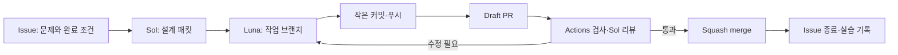

# 처음 해보는 GitHub 협업

저장소: [ekseh93/mimamori-ops](https://github.com/ekseh93/mimamori-ops)

## 지금부터의 순서

1. **협업 환경 준비**: Issue·PR·CI·보호 규칙을 갖추고 첫 CI 실패를 수정한다.
2. **로컬 장애 데모**: 사용자가 직접 실행해 정상 → 장애 → 복구 → 관측 누락을 설명한다.
3. **작은 개선 하나**: Issue를 골라 설계 Sol → 구현 Luna → 검증 Sol → merge 과정을 경험한다.
4. **AWS 준비**: 계정·무료 잔량·허가된 대상·비용과 실제 plan을 확인한다.
5. **승인된 AWS 파일럿**: 1개 대상부터 배포하고 실제 로그·알림·복구를 확인한다.
6. **취업용 증거 정리**: 직접 수행한 검증과 설계 이유를 일본어로 설명한다.

처음에는 Issues, Pull requests, Actions 세 탭만 익히면 된다. AI의 코드 작성과 본인이 직접 수행한 학습·운영을 구분한다.

## 화면에서 무엇을 확인하나

| 탭 | 보는 것 | 처음 확인할 질문 |
|---|---|---|
| [Issues](https://github.com/ekseh93/mimamori-ops/issues) | 할 일·버그·인수 조건 | 무엇이 되면 완료인가? |
| [Pull requests](https://github.com/ekseh93/mimamori-ops/pulls) | 변경 내용·대화·검사 | 왜 바꿨으며 검사는 통과했나? |
| [Actions](https://github.com/ekseh93/mimamori-ops/actions) | 자동 검사와 실패 로그 | 어느 단계에서 왜 실패했나? |
| [Security](https://github.com/ekseh93/mimamori-ops/security) | 취약점·비밀값·의존성 경보 | 새로 발견된 위험을 검토했나? |
| [Milestones](https://github.com/ekseh93/mimamori-ops/milestones) | 단계별 목표 | 지금 목표에 어떤 일이 남았나? |
| [Discussions](https://github.com/ekseh93/mimamori-ops/discussions) | 질문·학습 메모 | 아직 Issue로 정리하지 못한 질문이 있나? |
| Settings | 권한·브랜치 보호·Actions 설정 | 관리자가 필요할 때만 변경 |

개인 Projects 보드는 별도 계정 권한이 필요하다. 현재 CLI의 `read:project` 권한이 없어 생성하지 않았다. Issues의 라벨과 Milestone으로 할 일과 진행 상태를 관리할 수 있다. 사용자의 인증 권한을 임의로 확대하지 않는다.

## Issue 하나가 완료되는 흐름

- **브랜치**: main과 분리된 작업 공간. `codex/9-tls-integration`처럼 작업 번호와 목적을 적는다.
- **커밋**: 설명 가능한 변경 단위를 저장한 기록. 매 글자마다 하지 않고 기능·테스트·문서 등 작은 단위가 완성될 때 한다.
- **푸시**: 그 커밋을 GitHub의 작업 브랜치에 올려 진행 상황을 공유한다.
- **PR**: 작업 브랜치의 변경을 main에 합치기 전에 비교·토론·검사하는 자리다.
- **Draft**: 아직 작업 중이라는 표시. 완료한 것처럼 보이지 않게 먼저 열 수 있다.
- **Merge**: 검증된 변경을 main에 반영한다. 이 저장소는 squash 방식으로 PR 하나를 명확한 변경 단위로 남긴다.

## PR에서 보는 순서

1. **Conversation**: 문제, `Closes #번호`, 테스트 결과, 남은 제약을 읽는다.
2. **Commits**: 어떤 작은 단위로 작업했는지 확인한다.
3. **Files changed**: 실제 변경 코드와 문서를 읽는다.
4. **Checks**: Quality gate, PR readiness, Dependency review, CodeQL 결과를 확인한다.
5. 검토 의견이 해결되고 마지막 커밋의 필수 검사가 통과했는지 본다.
6. Merge 후 연결된 Issue가 닫혔는지, main의 CI도 통과했는지 확인한다.

녹색 체크는 해당 자동 검사 통과를 뜻한다. 사람이 검토했다거나 AWS 실제 운영이 성공했다는 뜻은 아니다.

## 첫 실패 사례: Linux Terraform 체크섬

[Issue #7](https://github.com/ekseh93/mimamori-ops/issues/7)의 첫 원격 CI에서 Python 테스트는 진행됐지만 Terraform validate가 실패했다. 원인은 Linux provider 패키지와 잠금 파일의 체크섬 불일치였다. Windows 로컬 검증만으로 Linux CI까지 검증했다고 말할 수 없다는 실제 사례다.

수정 방법: provider 버전은 유지하고 `terraform providers lock -platform=linux_amd64 -platform=windows_amd64`로 공식 서명된 양쪽 플랫폼의 체크섬을 기록한다. 수정 후 Linux GitHub CI에서 validate·mock test까지 다시 확인해야 완료다.

## 현재 역할과 승인

사람 관리자는 `ekseh93` 한 명이며, Sol·Luna는 AI 지원 역할이다. AI 검토 댓글에 모델과 검토 커밋을 밝힌다. 같은 사람 계정을 별도 팀원처럼 표시하거나 실제 하지 않은 리뷰 승인을 만들지 않는다.

한 명이 자기 PR을 승인해야 하는 막힘을 피하도록 사람 승인 수는 0으로 두되, PR 경로·자동 검사·대화 해결을 요구한다. 실제 협업자가 생기면 승인 수 1 이상과 CODEOWNERS 리뷰를 적용한다. main 강제 푸시와 삭제는 허용하지 않는다.

## 다음부터 agent에게 요청하는 말

> Issue #번호의 완료 조건을 확인하고 설계 → 구현 → 검증 순서로 진행해줘. 작업 단위마다 커밋·푸시하고 PR에서 진행 상황을 남겨줘. 마지막 커밋의 검사를 확인한 뒤 병합해줘.

AWS 배포는 별도 계정·비용·대상 확인이 필요하다. 현재 `AWS_DEPLOY_ENABLED=false`를 유지한다. 전체 개발을 무한 자동 실행하거나 새 기능을 끝없이 늘리는 요청으로 해석하지 않는다.
